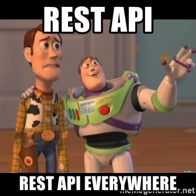

## Flask-RESTX
#### czyli restowe api w starym dobrym Flasku

&mdash; Pawel Stoworowicz 

---

### Agenda

1. Dlaczego ten temat?
2. Flask-RESTX - historia
3. Code walk
4. Podsumowanie

---

#### Motywacje

---

#### Motywacje cd

plus inspiracja ze strony Jakuba w postaci prezki o FastAPI ;)

---

#### Historia

Flask-RESTPlus umarł

Niech żyje Flask-RESTX!

---

#### Flask-RESTX

https://flask-restx.readthedocs.io/

> Flask-RESTX is an extension for Flask that adds support for quickly building REST APIs. Flask-RESTX encourages best practices with minimal setup. 

---

#### Code walk

---

#### Podsumowanie

1. Flask?
2. Lubie fakt ze endpointy sa grupowane w klasy
3. Marshallizery i modele
4. Zarzadzanie przez namespace'y
5. Bez fajerwerkow
6. Na minus - brak asynca...

---

#### Pytania?
https://github.com/stovorov/flask_restx_demo 